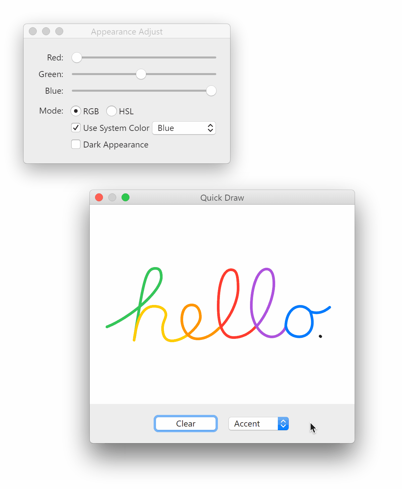

# Cocoa DOM

Cocoa DOM is a JavaScript framework designed to create macOS-like user interfaces in macOS-like ways. Named after and inspired by Apple’s Cocoa framework, it brings a familiar API for AppKit and UIKit developers.

## Installation

> *Note*: This project is not yet published. Please clone the repository and build it yourself.

1.  Clone the repository and build the project:

    ```sh
    npm install  # Currently, there’s no dependency.
    npm run build  # Compiles TypeScript files to `dist`.
    ```
2.  Include the CSS file in your HTML:

    ```html
    <link rel="stylesheet" href="<path-to-repo>/assets/index.css">
    ```
3.  In a module script, and include the umbrella file:

    ```html
    <script type="module">
        import { ... } from '<path-to-repo>/dist/index.js';
    </script>
    ```

An example usage can be found in the demo. See the [Demo](#demo) section for more information.

## Concepts

### `HIView` and `HIWindow`

The `HIView` class is the base for all UI entities, wrapping an HTML element and providing methods to manipulate it. Subclasses can override the static `makeDOM` method to provide custom elements.

`HIView` supports subviews. Adding a subview will insert its element as a child of the superview’s element. Subclasses can override the `insertDOMOfProposedSubview` method to customize this behavior.

To preserve the flexibility of CSS layout, `HIView` does not provide methods to manage positioning and sizing. Instead, it relies on their container superviews. However, `HIBox` still provides a frame-based layout and autoresizing for subviews that people love in Cocoa. Nevertheless, a view can override the `preferredSize` property for layout hints. There are also two methods, `layout` and `setNeedsLayout`, which help update the view’s size-aware appearance.

An `HIWindow` is the root object of a user interface. Note that an `HIWindow` is not something related to the BOM’s `window` object, but a container for views, managing a view hierarchy by its `contentView` property. A window can be styled, sized, and positioned. To show a window, call its `makeKeyAndOrderFront` method. To hide it, call `orderOut`. A window can also be made the main and/or key window. The key window is the one that receives keyboard events, and the main window is the one looks active.

### Event Handling

Event handling methods are defined on the `HIResponder` class, which is inherited by `HIView` and `HIWindow`. 

An `HIWindow` is the terminal of the responder chain. Keyboard events are dispatched to the `firstResponder` of the window, and mouse events are dispatched to the clicked view, initially. If the mouse is dragged or released outside the view, the view will still receive the events. To make a view receive advanced mouse tracking events, add an `HITrackingArea` to it.

Focus management relies on the `keyDOM` property of `HIView`, which returns the element to receive native keyboard events. If a view is made the first responder by the window’s `makeFirstResponder` method, its key element will be focused. The focus ring will also be drawn around that element. To tell the window that the frame of the focus ring has been changed internally, call the view’s `noteFocusRingChanged` method.

### Target–Action

The target–action mechanism is widely used in Cocoa DOM. An `HINotificationCenter` sends the notification to the observers’ action methods, and `HIControl` provides a target and an action to handle user interactions. There is no `HIApplication` class yet, therefore, the target determination is based on the window. `HIWindow` provides `targetForAction` and `sendAction` instance methods for this purpose. If the target is not specified, an `HIControl` will dynamically determine the target by calling the window’s related methods.

### Appearance

The visual appearance of a view or a window can be customized by setting the `appearance` property. If no appearance is set, the view inherits the appearance from its superview, and the root view inherits from the window. The default appearance is set based on the browser’s light/dark mode. You can also override it by setting the `system` static property of `HIAppearance`.

Dynamic colors can be represented by the `HIColor` class, which can be used in `CSSStyleDeclaration` objects by setting a property to the return value of the color’s `cssUsage` method. You can also register CSS variables using the static `addCSSVariableProvider` method of `HIAppearance` to make your CSS aware of the appearance. Despite the CSS-variable styling, a view also has the `didChangeEffectiveAppearance` methods to perform appearance-related tasks.

### Animation

The `HIAnimator` class provides a simple way to perform a frame-by-frame animation with a callback. The animation can be cancelled, and the animation provider may add an observer when the animation is finished or cancelled.

## Checklist

This project is still in development, and API is subject to change.

- [x] `HIResponder`
    - [x] Event handling
    - [x] `HIWindow`
        - [x] Window management
        - [x] Responder chain
        - [x] Key navigation
        - [ ] Sheets and modal windows
        - [ ] Zoom and minimize
        - [ ] Fullscreen
        - [ ] `HIPanel`
    - [x] `HIView`
        - [x] Hierarchy and window
        - [x] Event handling
        - [x] Appearance
        - [x] Set needs layout
        - [x] *Custom drawing* — by subclass `HIDrawingView`
        - [x] `HIControl`
            - [ ] Control sizes
            - [x] `HIButton`
                - [x] Radio button group
                - [x] `HIPopUpButton`
            - [ ] `HISegmentedControl`
            - [ ] `HITextField`
            - [ ] `HISwitch`
            - [x] `HISlider`
                - [x] Horizontal
                - [ ] Vertical
                - [ ] Circular
            - [x] `HIScroller`
                - [x] Legacy style
                - [x] Overlay style
            - [ ] `HIStepper`
            - [ ] `HIBrowser`
            - [ ] `HITableView`
        - [x] `HIBox`
            - [x] Frame-based layout
            - [x] Autoresizing mask
            - [ ] Titles
            - [ ] System-style boxes
        - [x] `HIScrollView`
            - [x] Content insets
            - [ ] Automatically adjust insets
            - [ ] Content view size observation
            - [ ] Scroll elasticity for all browsers
        - [ ] `HIStackView`
        - [ ] `HIGridView`
        - [ ] `HISplitView`
        - [ ] `HIVisualEffectView`
            - [x] Materials
            - [ ] ~~Behind-window blending~~ — Impossible with Cocoa DOM.
            - [ ] *Vibrancy* — Impossible until support of `plus-darker` and `plus-lighter`
- [x] `HICell`
    - [x] `HIButtonCell`
        - [x] Rounded style
        - [ ] Textured rounded style
        - [ ] Disabled appearance
        - [x] `HIPopUpButtonCell`
    - [ ] `HISegmentedCell`
- [x] `HITrackingArea`
    - [x] Mouse tracking
    - [ ] Only when first responder
    - [ ] Only when in key window
- [x] `HIAppearance`
- [x] `HIImage`
    - [ ] Remote images
- [x] `HIColor`
    - [ ] High-contrast colors
- [ ] `HIFont`
- [x] `HIAnimator`
    - [x] Frame-by-frame
    - [ ] CSS transition
- [x] `HINotificationCenter`
- [x] `HIMenu`
    - [x] Dynamically change items
    - [ ] Autovalidation
    - [ ] Submenu
    - [ ] Item with custom view
- [ ] Dock and menu bar

## Demo

> *Note*: This repo doesn’t include the `dist` folder. You need to build the project first.

The demo at `/test/demo.html` shows two windows. One window contains a set of controls that can customize the global appearance. The other window contains a custom view that allows you to draw strokes by dragging the mouse.



*The screen recording is taken on Chrome for Windows, so the font (Segoe UI) is not the same as macOS.*

This demo shows the following features:
  -  Graphical user interface that looks like macOS Sierra
  -  `setNeedsLayout` and autoresizing mask
  -  `setNeedsDisplay` and custom drawing
  -  Window management, key navigation, and focus ring

## Fun Fact

All types in Cocoa DOM are prefixed with `HI`, which stands for “Human Interface”. This is what Carbon did.

## License

This project is licensed under the MIT License. See the [LICENSE](LICENSE) file for details. However, the Aqua graphical user interface is patented by Apple Inc. and should not be used in commercial products.
